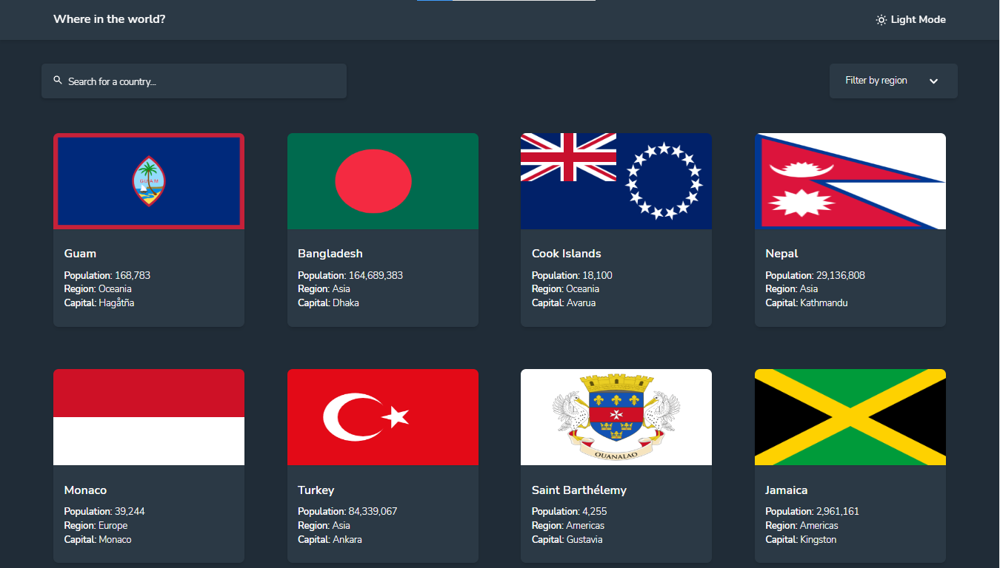

# Frontend Mentor - REST Countries API with color theme switcher solution

This is a solution to the [REST Countries API with color theme switcher challenge on Frontend Mentor](https://www.frontendmentor.io/challenges/rest-countries-api-with-color-theme-switcher-5cacc469fec04111f7b848ca). Frontend Mentor challenges help you improve your coding skills by building realistic projects. 

## Table of contents

- [Overview](#overview)
  - [The challenge](#the-challenge)
  - [Screenshot](#screenshot)
  - [Links](#links)
- [My process](#my-process)
  - [Built with](#built-with)
  - [Continued development](#continued-development)
- [Author](#author)

## Overview

### The challenge

Users should be able to:

- See all countries from the API on the homepage
- Search for a country using an `input` field
- Filter countries by region
- Click on a country to see more detailed information on a separate page
- Click through to the border countries on the detail page
- Toggle the color scheme between light and dark mode *(optional)*

### Screenshot

### Links

- Solution URL: [My solution on frontendmentor](https://www.frontendmentor.io/solutions/restcountriesapiproject-93-T7gp3Ke)
- Live Site URL: View my try [here](https://opeoluwa-ogunlaja.github.io/frontendmentor_rest-countries-api-with-color-theme-switcher-master/)

### Built with

- Mobile-first workflow
- [React](https://reactjs.org/) - JS library
- [React-Dropdown](https://www.npmjs.com/package/react-dropdown) - Dropdown package for react
- [React-spinners](https://www.npmjs.com/package/react-spinners) - Spinner package for react
- [Tailwind-CSS](https://tailwindcss.com/) - Utility class based CSS Framework (Just trying it out. Its cool 😁)

### Continued development
Need to learn how to:
- write clean code
- Use hooks effectively.

Open to any contributions please 😊. It's just a fork away! 😁

## Author
- Frontend Mentor - [@Opeoluwa-Ogunlaja](https://www.frontendmentor.io/profile/Opeoluwa-Ogunlaja)
